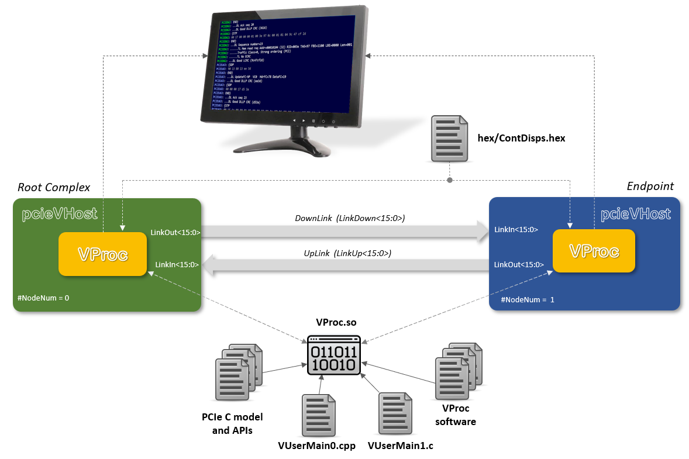

# _pcieVHost_ Main Test Bench

This test bench is the main simulation environment that serves as an example for deriving user specific test benches using the _pcieVHost_ Verilog VIP. The test bench instnatiates two _pcieVHOst_ components back-to-back, one configured as an upstream component (nearer the root complex) and one as a downstream component endpoint. The _pcieVHost_ components are configured for wide, for 8b10b encode data, and for 16 lane operation. The RC component used a _VProc_ node number of 0, for a user code ennry point of `VUserMain0()`, whilst the endpoint uses a node number of 1, for a user code entry point of `VUserMain1`. The diagram below shows the test bench's main connections.

<p align=center></p>

A testbench clock is generated at 500MHz, which is divided by 2 internally by the _pcieVHost_ components for GEN1 operation. The software is compiled into a shared object, `VProc.so`, loaded by the simulator at run time (see next section for compilation instructions). The _pcieVHost_ model has internal formatted link display output which is controlled by the `hex/ContDisps.hex` file, loaded at run time, to control the amount of output details and the times when the display is active.

## Compiling and Running

Make files are provided for all the supported Verilog simulators to compile the software, build the HDL, and run the simulation. The examples given below build all the relevant files and run a batch simulation.

```
  make [-f maklefile] run        # Questa
  make -f makefile.ica run       # Icarus Verilog
  make -f makefile.verilator run # Verilator
  make -f makefile.vivado run    # Vivado XSIM
```

Other options are available and the `make [-f <make file>] help` command will display a message like the following:

```
  make help          Display this message
  make               Build C/C++ code without running simulation
  make sim           Build and run command line interactive (sim not started)
  make run           Build and run batch simulation
  make rungui/gui    Build and run GUI simulation
  make clean         clean previous build artefacts
```

By default the user test code in `usercode` is compiled and run, but other tests can be selected from other directories. E.g.:

```
  make USRCDIR=usercodeEnum run
```
If other tests have a different set of files from the `usercode` directory, then the `USER_C` make file variable can be overridden on the command lane to list the files in the test directory.
