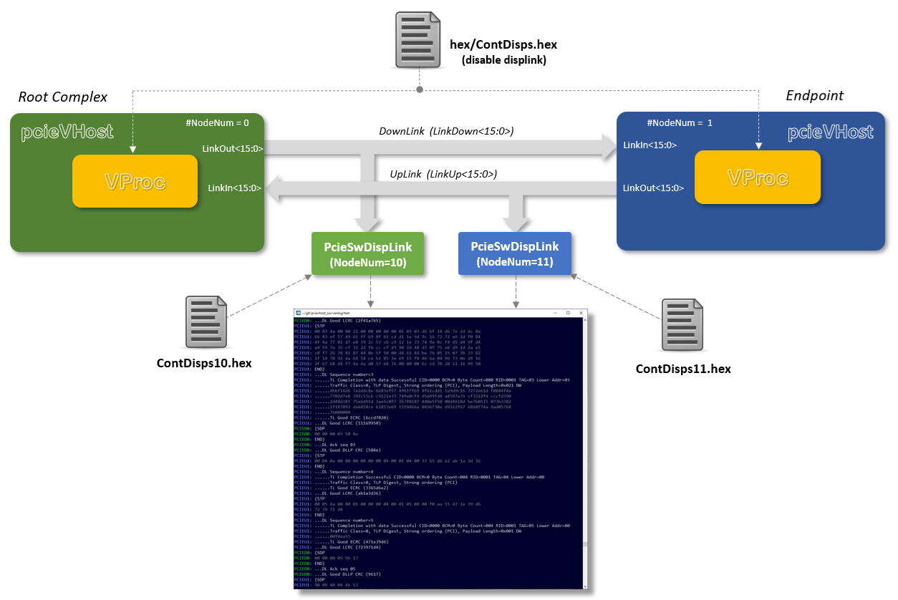
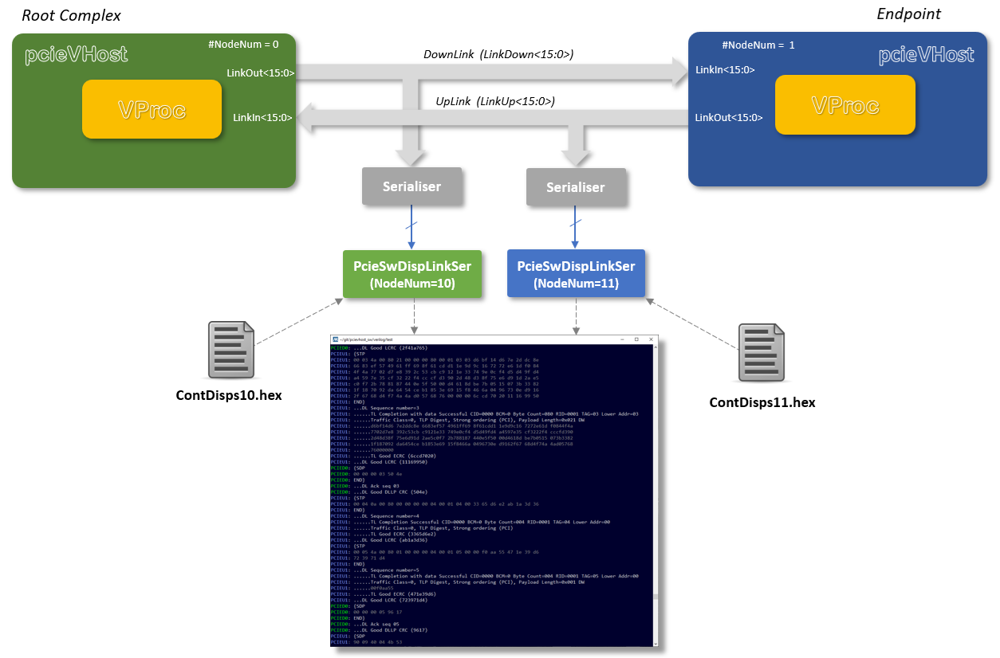

# testswdisplink Test Bench

Top level test bench for verifying the wide (parallel) and serial _pcieVHost_ software displink functionality

## Compiling and Running Test For Parallel Software Link Display

The default test bench uses the `test.v` file defining a top level `test`. Two _pcieVHost_ components are instantiated at nodes 0 and 1 (for RC and EP respectively) and the test is configuired for a 2 lane link, with full 8b10b encoding. The diagram below shows the layout for this test bench.

<p align=center></p>

Compilation between the simulators is very similar, but the correct make file must be selected for each to get the simulator specific settings. (A `makefile.common` file houses the commmon settings and is included by the simulator specific make files.). The examples below for the supported simulators show compiling and running in batch mode. Other modes are available and `make [-f <makefile>] help` displays the options.

### Questa

```
    make run
```

### Icarus Verilog

```
    make -f makefile.ica run
```

### Verilator

```
    make -f makefile.verilator run
```

### Vivado XSIM

```
    make -f makefile.vivado run
```

## Compiling and Running Test For Serial Software Link Display

The serial link display test bench uses the `testser.v` file defining a top level `testser`. Two _pcieVHost_ components are instantiated at nodes 0 and 1 (for RC and EP respectively), just as for the default test bench, with the parallel link signals serialised with two `Serialier` modules, and the serial signals set to two `PcieSwDispLinkSer` modules. As for the other test, `testser` is configuired for a 2 lane link, with full 8b10b encoding. The diagram below shows the layout for this test bench.

<p align=center></p>

For the serial link display test the compilation between the simulators require some more specific settings on the command line, using the appropriate make file. A different top level test module must be selected by setting the `PCIE_TOP` make variable, and this is common between all the simulators. A Verilog definition, `SERIALTEST` must be specified to change some internal settings, and the exact method varies between simulators. A `USRVLOGFLAGS` make file variable is used to add the approriate command line flag for the simulator. The examples below show compiling and running in batch mode for the supported simulators with the make file variable setting required. Other modes are available and `make [-f <makefile>] help` displays the options.

### Questa

```
    make PCIE_TOP=testser USRVLOGFLAGS="+define+SERIALTEST" run
```

### Icarus Verilog


```
    make -f makefile.ica PCIE_TOP=testser USRVLOGFLAGS="-DSERIALTEST" run
```

### Verilator

```
    make -f makefile.verilator PCIE_TOP=testser USRVLOGFLAGS="+define+SERIALTEST" run
```

### Vivado XSIM

```
    make -f makefile.vivado PCIE_TOP=testser USRVLOGFLAGS="-d SERIALTEST" run
```

