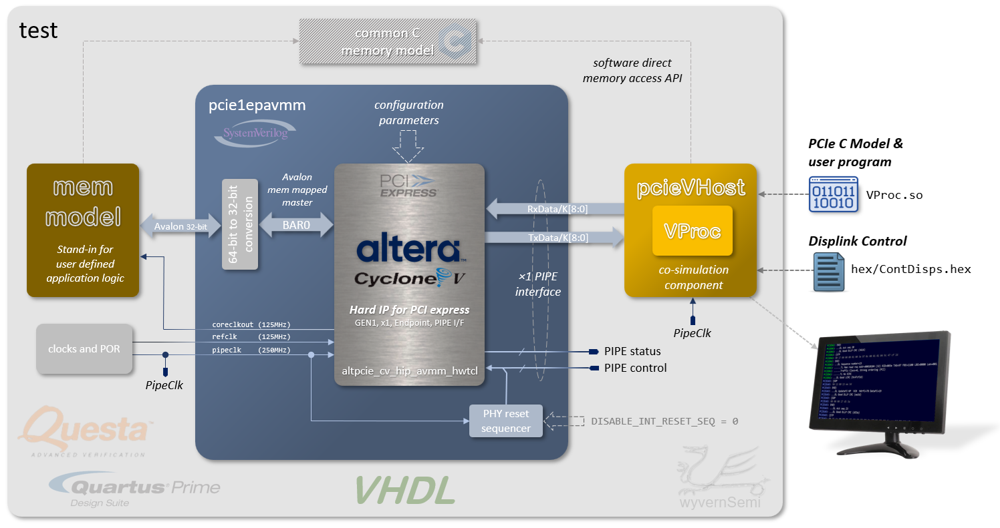

# VHDL Test Environment for Altera Cyclone V Hard IP for PCI Express

This directory contains an example VHDL test bench for driving the simulation model of the _Altera Cyclone V Hard IP for PCI Express_ using the _pcieVHost_ model. The test bench has been constructed for use with the _Quartus Prime SC Lite Edition version 25.1std_, including the _Questa Altera Starter FPGA Edition-64 2025.2_ simulator. Pre-compiled libraries for the PCIe IP are provided for these editions. For different editions, the pre-compiled libraries may not function and a QSYS file is provided to generate the simulation source files and build the libraries from scratch. The accompanying `makefile` will generate the libraries if the `libraries` folder is not present. This build process relies on Quartus Prime tools being installed and on the search path.

<span style="color:red">**THIS TESTBENCH IS FOR QUESTA SIMULATOR ONLY.**</span>

# Test Bench Structure

The diagram below shows the structure of the test bench.



The top level `test` module instantiates the Altera PCIe component, wrapped in a SysteVerilog module (`pcie1epavmm`) to abstract away the setting of the configuration parameters and only expose the ports that are required. Within this wrapper, the Altera PCIe IP is configured in the following way:

* GEN 1
* An Endpoint
  * Completer only
* Single Lane PCIe link
* PIPE interface (only for simulation&mdash;not supported for synthesis)
* Single configured 32-bit, non-prefetchable BAR, resulting in a single Avalon memory mapped master interface
    * 32-bit address
    * 64-bit data

The `pcie1epavmm` module also contains logic to convert the 64-bit data bus to 32-bits and a process to generate the PHY receiver reset sequence for the appropriate PIPE control signals, though this can be disabled through a parameter for driving the signals externally.

A `pcieVHost` component is instantiated, configured as a single lane PCIe interface and wired for PIPE operations (set in the program software). The single lane PIPE TX and RX ports are connected to the `pcie1epavmm` PIPE data ports.

The Avalon memory mapped interface is connected to a `mem_model` component with an equivalent slave interface. This acts as a target for memory reads and writes, in place of what would be the user application logic as either a single unit block, a sub-system of even the whole design logic.

Finally, the top level `test` generates two colcks and a power-on reset signal. The Altera PCIe IP requires a `pipeclock` at the appropriate frequency for the interface. As this is for GEN1, and the PIPE interface is configured to be 8-bits, then this is generated at 250MHz. A reference clock (`refclk`) is also required. The Altera IP allows for either a 100MHz clock or a 125MHz clock and, for this test bench, the IP is configured for 125MHz. The Altera IP generates a `coreclkout` signal, at 125MHz (regardless of the `refclk` frequency) which is the clock that the Avalon interface uses, and so the `mem_model` clock is connected to this. The `pcieVHost` component is connected to the `pipeclk` signal.

At run time, the simulator will load the compiled `VProc.so` library containing the PCIe C model and the user test program. The PCIe model will then load the _DispLink_ text control file from `hex/ContDisps.hex` to determine the decoded link display information sent to the console.

# The Test Program

## Compiling and Running the Test

To build and run the test as a batch simulation, run:

```
make run
```

There are other options, and typing `make help` gives the following output:

```
make help          Display this message
make               Build C/C++ code without running simulation
make sim           Build and run command line interactive (sim not started)
make run           Build and run batch simulation
make rungui/gui    Build and run GUI simulation
make clean         clean previous build artefacts
make cleanlib      Clean previous pcie_cv_hip_avmm_0 library build artefacts
```

## The Test Functionality

For this test, the user progrm in `usercode/VUserMain0.cpp` does the following steps. in order.

* Waits for POR to be deasserted
* Initiates the link training sequence from electrically idle to the L0 "Link Up" state (`L0`)
* Initiates DLL VC0 flow control initialisation
* Does configurations space reads, and prints out contents, from 
  * PCI space Vendor ID and Device ID
  * PCI space Command and Status registers
  * PCI space Revision ID and Class Code
  * PCI space Header Type
  * PCI space BARs 0 to 5
* Does a walk through the capabilities structures
  * Prints out found capabilities type and contents
* Configures BAR0 for address `0x00010000` with a configuration space write
* Enables memory accesses in Command register with a configuration space write
* Writes a 32-bit word to memory with a memory write command
* Writes a 16-bit word to memory with a memory write command
* Reads back first word with a memory read command and verifies
* Reads back second half-word with a memory read command and verifies
* Waits for some cycles
* Finishes the simulation

# The Model and Test Output

When the test is run, the supplied `hex/ContDisps.hex` will dsplay decoded link traffic once the LTSSM reaches L0. Mixed in with the test output. When run with `hex/ContDisps.hex` configured for no DispLink output, the model and test program outputs:

```
VInit(0): initialising FLI interface
  VProc version 1.13.5. Copyright (c) 2004-2026 Simon Southwell.
InitialisePcie() called from node 0
InitialisePcie: Info --- valid linkwidth (1) at node 0
  pcieVHost version 1.7.0

---> Detect Quiet (node 0)
---> Detect Active (node 0)
---> rcvr_idle_status = 0 (node 0)
---> Polling Active (node 0)
---> Polling Config (node 0)
---> Active lanes = 0x0001 (node 0)
---> Configuration Start (node 0)
---> Configuration Linkwidth Accept (node 0)
---> Configuration Lanenum Wait (node 0)
---> Configuration Lanenum Accept (node 0)
---> Configuration Complete (node 0)
---> Configuration Idle (node 0)
---> Configuration exit to L0 (node 0)
  ===> Vendor ID read back 0x14fc
  ===> Device ID read back 0x0001
  ===> Command   read back 0x0000
  ===> Status    read back 0x0010
  ===> Revision ID read back 0x01
  ===> Class code read back class=0x02 subclass=0x80 progif=0x01
  ===> Header type read back 0x00
  ===> BAR0 writing   0xffffffff
  ===> BAR0 read back 0xfffff000 = 4096 bytes
  ===> BAR1 writing   0xffffffff
  ===> BAR1 read back 0x00000000 = 0 bytes
  ===> BAR2 writing   0xffffffff
  ===> BAR2 read back 0x00000000 = 0 bytes
  ===> BAR3 writing   0xffffffff
  ===> BAR3 read back 0x00000000 = 0 bytes
  ===> BAR4 writing   0xffffffff
  ===> BAR4 read back 0x00000000 = 0 bytes
  ===> BAR5 writing   0xffffffff
  ===> BAR5 read back 0x00000000 = 0 bytes
  ===> Found MSI capability
      0x008a7805
      0x00000000
      0x00000000
      0x00000000
      0x00000000
      0x00000000
  ===> Found Power Mangement capability
      0x00038001
      0x00000000
  ===> Found PCIe capability
      0x00020010
      0x00008020
      0x00002810
      0x01406411
      0x10110000
      0x00040000
      0x00000000
      0x00000000
      0x00000000
      0x0000001f
      0x00000000
      0x00000000
      0x00010001
      0x00000000
      0x00000000
  ===> BAR0 setting address to 0x00010000
  ===> Writing 0x0002 to Command register to enable memory accesses
  ===> Writing   word      0x900dc0de to mem addr   0x00010080
  ===> Writing   half-word 0xcafe     to mem addr   0x00010106
  ===> Read back word      0x900dc0de from mem addr 0x00010080
  ===> Read back half-word 0xcafe     from mem addr 0x00010106

*********** test finished with no errors: PASS ***********


```
